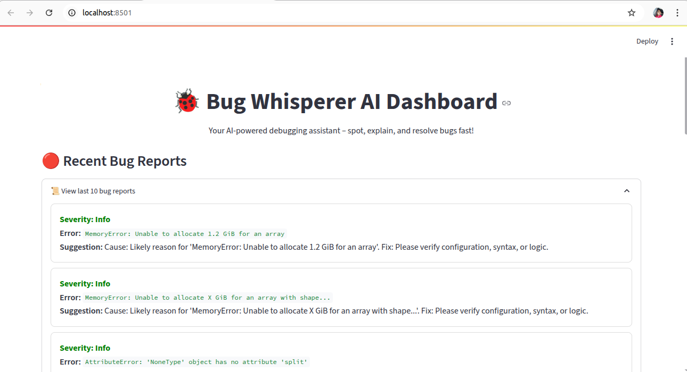
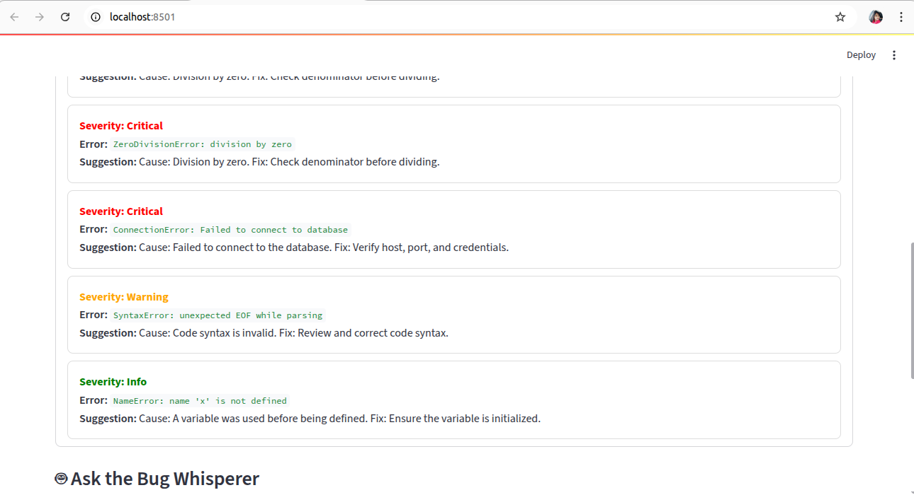
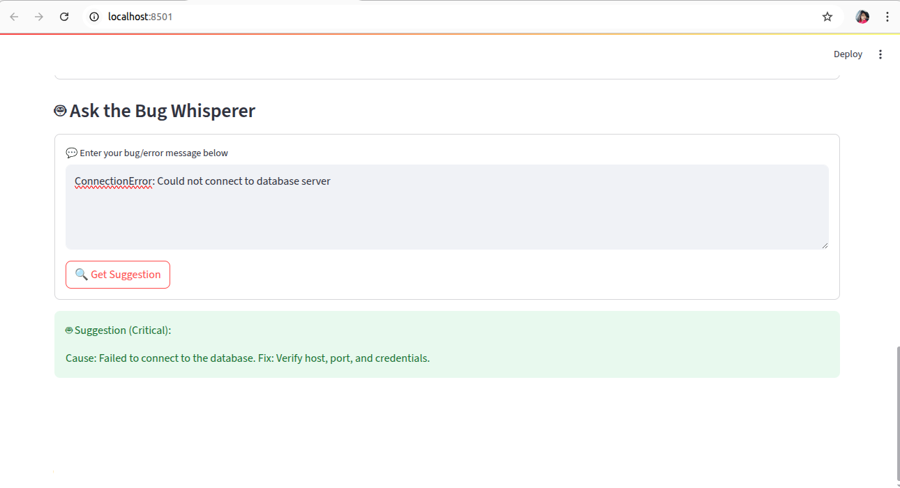

# 🐞 Bug Whisperer – AI-Powered Debugging with Redis

**Bug Whisperer** is an AI-powered debugging assistant that listens for error logs in real time, classifies their severity, explains the cause, and suggests fixes.  
It stores embeddings of each bug so it can instantly recall and provide suggestions for similar issues in the future.

Built for the **Dev.to Hackathon** 🏆

## 📸 Preview

<p align="center">
  
  
  
</p>


---

## 🚀 Features
- **Real-Time Bug Detection** – Uses Redis Streams to ingest logs instantly.
- **Severity Classification** – Marks errors as Critical, Warning, or Info.
- **AI-Powered Suggestions** – Uses `google/flan-t5-base` for explanations.
- **Template Fallbacks** – Common errors get quick, pre-written fixes.
- **Memory Retrieval** – Similar bugs are fetched from Redis to save time.
- **Interactive Dashboard** – Streamlit UI to view logs & chat with the assistant.

---

## 🛠 Tech Stack
- **Backend**: Python, Redis Streams
- **AI Models**:  
  - `google/flan-t5-base` – Error explanation  
  - `all-MiniLM-L6-v2` – Semantic similarity
- **Frontend**: Streamlit dashboard
- **Storage**: Redis Hashes + Lists

---

## 📦 Installation

### 1️⃣ Clone the repository
```bash
git clone https://github.com/yourusername/bug-whisperer.git
cd bug-whisperer

### 2️⃣ Create virtual environment & install dependencies

python -m venv .venv
source .venv/bin/activate    # macOS/Linux
# .venv\Scripts\activate     # Windows

pip install -r requirements.txt

### 3️⃣ Set up environment variables

REDIS_URL=redis://localhost:6379/0

### 4️⃣ Usage Instructions

# Start Redis (if not already running)
redis-server --daemonize yes

# Terminal 1 – Run the consumer
python consumer.py

# Terminal 2 – Push a test bug
python
>>> import redis, os
>>> from dotenv import load_dotenv
>>> load_dotenv()
>>> r = redis.Redis.from_url(os.getenv("REDIS_URL"))
>>> r.xadd("bug_logs", {"error": b"TypeError: 'int' object is not subscriptable"})

# Expected Output

🐞 Bug detected: TypeError: 'int' object is not subscriptable
🤖 Suggestion (Info):
Cause: ...
Fix: ...

# Terminal 3 – Run dashboard
streamlit run dashboard.py

### 5️⃣ Project Structure

bug-whisperer/
├── consumer.py       # AI consumer that listens to Redis Stream
├── dashboard.py      # Streamlit dashboard
├── requirements.txt  # Dependencies
├── .env.example      # Environment variables template
└── README.md         # Documentation

### 6️⃣ How It Works

1. Error is pushed to Redis Stream (bug_logs).

2. consumer.py classifies severity, checks Redis for similar bugs, generates fix.

3. Stores bug in Redis hash (bug:{id}) and list (bug_index).

4. Dashboard reads from Redis and lets you query via chat.

### 7️⃣ Example Errors to Try

ConnectionError: Failed to connect to database
ZeroDivisionError: division by zero
TypeError: 'int' object is not subscriptable
SyntaxError: invalid syntax
NameError: name 'response' is not defined

###  8️⃣ Future Improvements

1. Auto-log ingestion from app servers

2. Slack/Discord bot notifications

3. Multi-language support

4. Bug frequency analytics

### 9️⃣ License
MIT License © 2025 Thabasvini